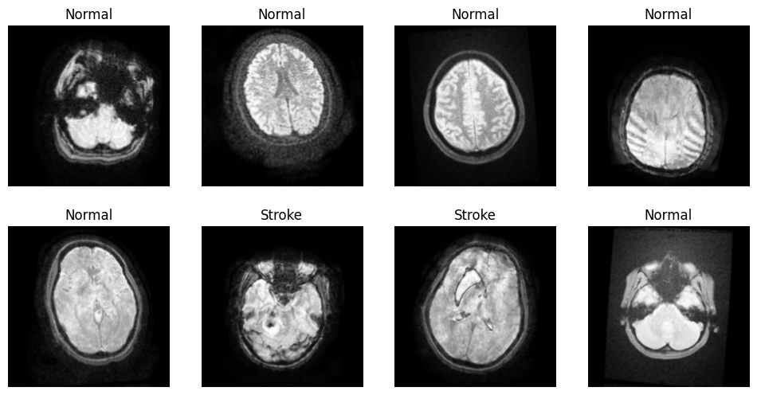

# MRI Brain Stroke Classification and Segmentation

This repository contains a comprehensive set of tools and notebooks for processing MRI brain scans, classifying strokes, and segmenting tumors using computer vision and deep learning techniques.

## Table of Contents
1. [Project Overview](#project-overview)
2. [Dataset](#dataset)
3. [Notebooks](#notebooks)
4. [Setup and Installation](#setup-and-installation)
5. [Usage](#usage)
6. [Contributing](#contributing)

## Project Overview

This project aims to:
1. Process raw MRI brain scan images
2. Segment tumors from preprocessed MRI brain scan images using computer vision techniques
3. Classify whether a stroke is present or not
4. If a stroke is detected, classify it as ischemic or hemorrhagic

We utilize OpenCV for image processing and FastAI for deep learning-based classification.

## Dataset

The dataset used in this project consists of MRI brain scan images. It is organized into several folders containing raw and processed images, as well as patient details.

For detailed information about the dataset structure and download instructions, please refer to the [Dataset README](./dataset/README.md).

## Notebooks

This repository contains the following Jupyter notebooks:

1. `1_MRI_images_Brain_preprocessing.ipynb`
   - Processes raw MRI images
   - Removes patient details from the MRI scans
   - Highlights relevant features

2. `2_Haemorrhagic_Segmentation.ipynb`
   - Uses computer vision techniques to detect hemorrhagic tumors
   - Implements Canny edge detection, Gaussian blur, and contrast enhancement

3. `3_Ischemic_Segmentation.ipynb`
   - Uses computer vision techniques to detect ischemic tumors
   - Implements Median Filter and erosion

4. `Ischemic_&_Haemorrhagic_Classification.ipynb`
   - Uses FastAI to train and compare models for classifying ischemic and hemorrhagic strokes
   - Models compared: ResNet, DenseNet, SqueezeNet, AlexNet

5. `Stroke_NoStroke_Classification.ipynb`
   - Uses FastAI to train and compare models for classifying the presence or absence of strokes
   - Models compared: ResNet, DenseNet, EfficientNet, VGG16

## Setup and Installation

1. Clone this repository:
   ```
   git clone https://github.com/your-username/mri-stroke-classification.git
   cd mri-stroke-classification
   ```

2. Create a virtual environment (optional but recommended):
   ```
   python -m venv venv
   source venv/bin/activate  # On Windows, use `venv\Scripts\activate`
   ```

3. Install the required packages:
   ```
   pip install -r requirements.txt
   ```

4. Download the dataset following the instructions in the [Dataset README](./dataset/README.md).

## Usage

1. Start by running the preprocessing notebook:
   ```
   jupyter notebook 1_MRI_images_Brain_preprocessing.ipynb
   ```

2. After preprocessing, you can run the classification notebooks:
   ```
   jupyter notebook Stroke_NoStroke_Classification.ipynb
   jupyter notebook Ischemic_&_Haemorrhagic_Classification.ipynb
   ```

3. For tumor segmentation, use the respective notebooks:
   ```
   jupyter notebook 2_Haemorrhagic_Segmentation.ipynb
   jupyter notebook 3_Ischemic_Segmentation.ipynb
   ```

Follow the instructions within each notebook for detailed usage.

## Contributing

Contributions to this project are welcome! Please follow these steps:

1. Fork the repository
2. Create a new branch: `git checkout -b feature-branch-name`
3. Make your changes and commit them: `git commit -m 'Add some feature'`
4. Push to the branch: `git push origin feature-branch-name`
5. Create a pull request


---

For any questions or issues, please open an issue in this repository.