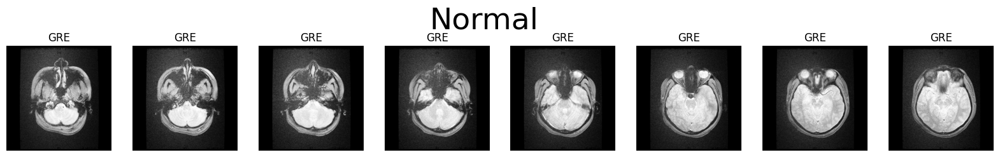

# MRI Brain Image Dataset



This README provides instructions for downloading and understanding the structure of our MRI Brain Image Dataset, which is hosted on Google Drive.

## Dataset Overview

The dataset consists of three main folders:

1. **Dataset_MRI_Folder**
   - Contains three subfolders:
     - Haemorrhagic
     - Ischemic
     - Normal
   - Each subfolder contains raw MRI brain images of patients.

2. **Normal _ Stroke Patient Details**
   - Contains MRI Brain Scan images of different patients.

3. **Stroke Classification**
   - Contains three subfolders:
     - Haemorrhagic (186 images)
     - Ischemic (30 images)
     - Normal (399 images)
   - Each subfolder contains processed MRI brain images of patients.

## Downloading the Dataset

To download the dataset, follow these steps:

1. **Access the Google Drive link**: 
   [Insert your Google Drive link here]

2. **Download method**:
   - If the folder is small enough, you may be able to download it directly by right-clicking and selecting "Download".
   - For larger folders, you might need to use Google Drive's "Add to My Drive" feature, then use the Google Drive desktop app to sync the folder to your computer.

3. **Alternative download method**:
   
   Google Drive Dataset Link - https://drive.google.com/file/d/1F0YZH0jDnELuBgRBgeuASErBwa8zo37-/view?usp=sharing

   If you're comfortable with command-line tools, you can use `gdown`, a Python package for downloading large files from Google Drive:

   ```
   # Install gdown
   pip install gdown

   # Download the dataset    
   gdown https://drive.google.com/file/d/1F0YZH0jDnELuBgRBgeuASErBwa8zo37-/view?usp=sharing
   ```

4. **Unzip the dataset**: 
   If the downloaded file is a zip archive, unzip it to access the folder structure described above.

## Dataset Structure

After downloading and extracting, you should have the following folder structure:

```
MRI_Brain_Dataset/
├── Dataset_MRI_Folder/
│   ├── Haemorrhagic/
│   ├── Ischemic/
│   └── Normal/
├── Normal _ Stroke Patient Details/
└── Stroke Classification/
    ├── Haemorrhagic/ (186 images)
    ├── Ischemic/ (30 images)
    └── Normal/ (399 images)
```

## Usage Notes

- The images in the `Dataset_MRI_Folder` are raw MRI scans.
- The `Normal _ Stroke Patient Details` folder contains additional patient information.
- The `Stroke Classification` folder contains processed images, categorized by stroke type.

## Ethical Considerations

- This dataset contains sensitive medical information. Ensure you have the necessary permissions and comply with relevant data protection regulations when using this dataset.
- Use the data responsibly and respect patient privacy at all times.

## Contact

If you encounter any issues with downloading or using the dataset, please contact [Your Contact Information].

---

Happy researching!